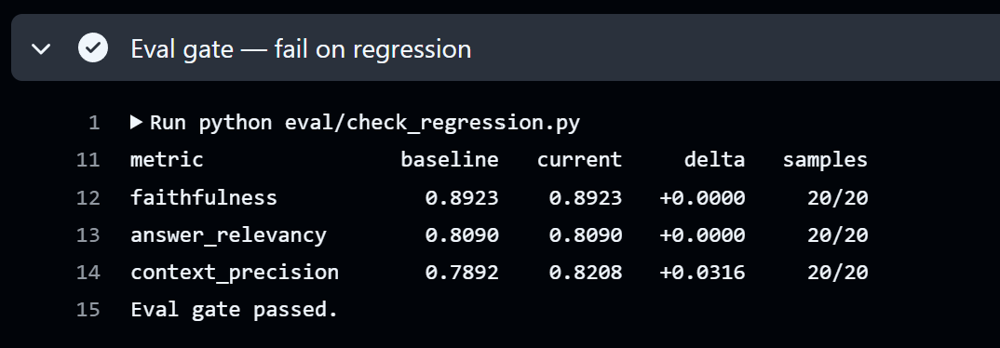
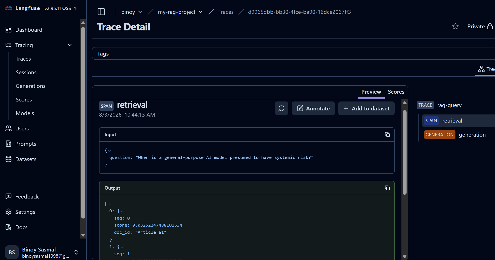
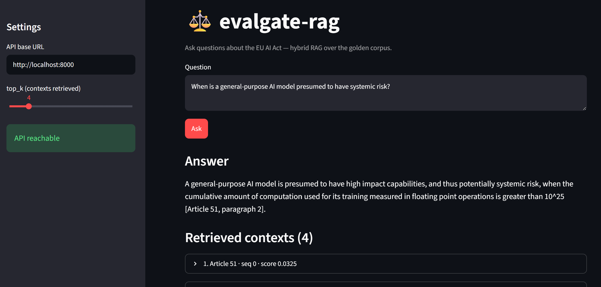

# evalgate-rag

**A RAG service that cannot silently get worse.**

Hybrid-retrieval question answering over the **EU AI Act** (Regulation (EU) 2024/1689),
with an evaluation gate wired into CI: every change is scored with
[Ragas](https://docs.ragas.io) against a curated golden set, and **the build fails
if faithfulness, answer relevancy, or context precision regress** beyond tolerance.

| | |
|---|---|
| Serving | FastAPI, Docker, non-root multi-stage image |
| Retrieval | BM25 + pgvector dense search, Reciprocal Rank Fusion |
| Store | PostgreSQL 16 + pgvector (HNSW index) |
| Observability | Langfuse tracing on every query (self-hosted via compose profile) |
| Evaluation | Ragas: faithfulness · answer relevancy · context precision |
| Deployment | Terraform → single EC2 instance, ~$13/month (free on a legacy Free Tier account) ([docs/deploy-aws.md](docs/deploy-aws.md)) |
| CI/CD | GitHub Actions — `ci.yml` (lint · types · unit · pgvector integration · Docker build → GHCR) plus a separate **`eval-gate.yml`** (the Ragas gate) |
| LLM | Any OpenAI-compatible endpoint (default: **Groq free tier**, `qwen/qwen3.8-27b`) |
| Embeddings | Local, offline via **fastembed** (BAAI/bge-small-en-v1.5, 384-dim) — Groq has no embeddings API |

## Why the eval gate matters

RAG systems degrade invisibly: a prompt tweak improves one answer and quietly
breaks five others; a chunking change shifts retrieval in ways no unit test sees.
Treating eval metrics like a test suite — with a baseline, a tolerance, and a
red build on regression — is the difference between a demo and a system.

```
PR opened ──▶ lint/type/unit ──▶ pgvector integration ──▶ [label: run-eval]
                                                              │
                                              Ragas over 20-question golden set
                                                              │
                                    delta vs eval/baseline.json > −0.03 ? ──▶ ❌ build fails
                                                              │
main ──▶ ci.yml: lint/type/unit/integration ──▶ Docker build ──▶ push ghcr.io/…:sha
```

> **Re-baselining in progress.** Groq decommissioned `llama-3.3-70b-versatile`,
> the model `eval/baseline.json` was measured on. The default is now
> `qwen/qwen3.8-27b`; scores are not comparable across a model swap, so the
> gate's push-to-main trigger is temporarily disabled while a full-sample run
> on the new model is produced and promoted. The gate still runs on demand and
> on any PR labelled `run-eval`. No threshold was relaxed and the committed
> baseline was not edited — see `.github/workflows/eval-gate.yml`.



<sub>The eval gate on a real run — `faithfulness`, `answer_relevancy`, and `context_precision` each vs the committed baseline, with sample counts. The build fails on any regression beyond tolerance.</sub>

## Quickstart

```bash
cp .env.example .env                      # add your Groq API key (console.groq.com/keys)
docker compose up -d db                   # Postgres + pgvector
pip install -e .[dev,embed-local]         # embed-local pulls fastembed (local, offline)

# the EU AI Act corpus ships in the repo (data/corpus/) — no fetch needed.
# (to refresh it from EUR-Lex later: python scripts/fetch_corpus.py)
python scripts/ingest.py --strategy recursive
uvicorn evalgate_rag.api:app --reload

curl -s localhost:8000/query -X POST -H 'content-type: application/json' \
  -d '{"question": "What are the maximum fines for prohibited AI practices?"}' | jq
```

With tracing: `docker compose --profile tracing up -d`, open Langfuse at
`localhost:3000`, create a project, put the keys in `.env`, set `LANGFUSE__ENABLED=true`.
Every query then produces a trace with a retrieval span (chunk IDs + scores) and
a generation span.



## LLM

Default configuration runs generation and Ragas judging on **Groq's free tier**
(`qwen/qwen3.8-27b`, OpenAI-compatible) and embeddings **locally via
fastembed** — Groq has no embeddings endpoint, so nothing embedding-related
ever leaves the machine. Swapping to any other OpenAI-compatible provider
(OpenAI, Azure via gateway, Ollama, vLLM) is still just an env-var change.

**Hosted models get retired, and that breaks the gate, not just the app.** The
default was `llama-3.3-70b-versatile` until Groq decommissioned it; the next
eval run died in four seconds on `404 model_not_found`, and — worse — orphaned
a baseline measured on a model that no longer exists. A dependency can be
pinned; a hosted model cannot. List what is actually offered before assuming a
model id is still live:

```bash
curl -H "Authorization: Bearer $LLM__API_KEY" \
     https://api.groq.com/openai/v1/models | jq '.data[].id'
```

`qwen/qwen3.8-27b` was chosen over `openai/gpt-oss-*` because the gpt-oss
models emit reasoning tokens — ~139 completion tokens versus qwen's 22 on the
same grounded prompt — and the Ragas judge runs on this same model, against a
daily cap a full run already strains.

Groq's free tier is rate-limited (30 RPM / ~12K
TPM / 1K RPD), plus — easy to miss — a **100K tokens/day (TPD)** cap. TPD is
the one that actually bites: the golden set's questions × (1 generation call
+ 3 judge-metric calls each, all resending the full retrieved context) is
enough to threaten it well before the RPM/TPM numbers become a problem.

- `LLMClient` retries HTTP 429s automatically, honouring the response's
  `retry-after` header and falling back to exponential backoff — but a 429
  whose suggested wait is long (a hard quota like TPD, not a short RPM/TPM
  blip) is raised immediately instead of retried; waiting once more inside
  the same process won't clear a daily cap.
- `LLM__MIN_INTERVAL_S` (default `0`) adds a minimum delay between requests so
  a full eval run stays under the TPM cap — set it to a few seconds for eval
  runs; leave it at `0` for interactive `/query` traffic.

If you switch `EMBEDDING__PROVIDER` (e.g. `fastembed` ↔ `openai`), the vector
dimension changes (384 vs. 1536), so **re-ingest the corpus** after switching:
`python scripts/ingest.py --strategy recursive` recreates the pgvector column
at the new embedder's dimension.

Run the evaluation locally:

```bash
pip install -e .[eval,embed-local]
python eval/run_eval.py --limit 3          # throttled smoke test — a few questions
python eval/run_eval.py                    # answers all golden-set questions, scores with Ragas
python eval/check_regression.py            # the same gate CI runs
```

The Ragas judge LLM reuses `LLM__*` settings (so it also runs on Groq) but
Ragas is configured with `RunConfig(max_workers=1)` so judge calls run
sequentially — parallel judge calls would blow through the RPM/TPM caps.

**The run is resumable.** Generated answers and judge scores are cached to
`eval/.cache/` as they're produced (per question, and per question+metric for
judge scores), so a run that dies partway through — a real risk against a
100K/day budget — doesn't redo work that already succeeded on rerun. In CI the
cache is persisted across runs (saved even when the gate fails on a partial),
so successive triggers accumulate toward a full sample across the daily budget.
The cache auto-invalidates if the prompt, model, `retrieval_top_k`, embedding
provider, or `golden_set.jsonl` changes; pass `--fresh` to force a clean run
outright (needed after a corpus re-ingest or chunking-strategy change, since
that state lives in Postgres and isn't visible to this script).

## Deploying to AWS

[`terraform/`](terraform/) stands the whole service up on a single EC2 instance —
API and pgvector side by side, ingest run automatically on first boot.

```
        allowed_cidr only          ┌──────────────────────────┐
   (no auth on /query, so this ───▶│  EC2 t3.micro            │
    is the access control)    :80  │  ┌────────┐  ┌────────┐  │
                                   │  │  api   │  │  pg16  │  │  docker compose
                                   │  │ :8000  │  │pgvector│  │
                                   │  └────────┘  └────────┘  │
                                   └──────────────────────────┘
                                        │ Internet Gateway (no NAT)
                                        ▼
                                   Groq · GHCR · SSM Parameter Store
```

**~$13/month**, and the omissions are the point: no load balancer (~$17), no NAT
gateway (~$33), no RDS (~$13), no Secrets Manager. Those four are most of what
turns a small AWS deployment into a $70 bill, and none are needed for one box —
a public subnet with a closed security group gives identical egress for $0, and
the database is reproducible from the image rather than precious.

The Groq key lives in SSM Parameter Store and is read at boot, so it never enters
Terraform state (a `sensitive = true` variable is still plaintext in
`terraform.tfstate`). Shell access is SSM Session Manager — no port 22, no key
pair, no bastion. IMDSv2 is required with a one-hop limit, so a compromised
container can't reach the instance role. A $1 budget alarm tracks cost *before*
credits are applied, because Budgets otherwise reports $0 on a credits-based
account while the balance quietly drains.

```bash
aws ssm put-parameter --name /evalgate-rag/llm-api-key   --type SecureString --value "gsk_..." --region eu-north-1

cd terraform && cp terraform.tfvars.example terraform.tfvars   # set allowed_cidr
terraform init && terraform apply

curl -s "$(terraform output -raw api_url)/ready"   # {"status":"ready","chunks":452}
```

Full runbook — prerequisites, cost table, teardown, and what to harden before this
is more than a demo — in [docs/deploy-aws.md](docs/deploy-aws.md).


<sub>Running on the deployed instance. The retrieval scores are RRF sums: Article 5 and
Article 99 sit near 0.03 because <em>both</em> the BM25 and dense legs surfaced them, while
a single-leg hit scores about 1/61 — the hybrid retrieval doing visible work.</sub>

**`/ready` is the endpoint that matters.** `/health` is liveness only and does no
I/O, so a database blip never gets the container restarted. `/ready` checks the
store is reachable *and* non-empty — because an un-ingested deployment doesn't
crash, it retrieves nothing and answers every question with "I cannot answer this
from the provided context". That looks like a broken model. It's a missing step,
and failing readiness makes it say so.

### What deploying it actually surfaced

Running this somewhere real found bugs that local development structurally cannot,
which is the honest argument for deploying a side project at all:

- **A single Postgres connection**, opened at startup and never replaced. Fine
  against a loopback; against a remote database any failover or idle timeout wedges
  the process permanently while `/health` keeps returning 200. Now a pooled
  connection checked on checkout — with a test that kills every backend via
  `pg_terminate_backend` and asserts recovery.
- **A 130MB model download on every cold start.** `fastembed` fetched BGE-small
  from HuggingFace on first construction, making boot depend on a third party and
  overrunning the healthcheck's start period. Now baked into the image; verified by
  ingesting with `HF_HUB_OFFLINE=1`.
- **A per-request value written onto a shared object.** `/query` assigned `top_k`
  to the pipeline instance, which FastAPI shares across threadpool requests — so one
  caller's override leaked into the next. Now a parameter.
- **No `max_tokens` on the LLM request.** Providers reserve per-minute output budget
  against a request's *expected* output; with no ceiling declared, Groq reserved the
  model default of 2048 against a 1000 output-tokens-per-minute cap and rejected
  every call. Worse, the 429 retry path backed off and retried — but a 429 about
  request *size* never succeeds on retry, and each attempt reserved more of the
  budget it was waiting to free.

## UI

A minimal Streamlit client for interacting with the API — a question box, a
`top_k` slider, the answer, and the retrieved contexts (each chunk's `doc_id`,
`seq`, `score`, and text, expandable) so hybrid retrieval and citations are
visible. It hits `/health` on load and degrades gracefully when the API is
unreachable or the LLM backend is rate-limited (a 502 from `/query`).



```bash
pip install -e .[ui]                       # streamlit; reuses core httpx
uvicorn evalgate_rag.api:app --reload      # the API, in one terminal
streamlit run ui/app.py                    # this UI, in another
```

The base URL defaults to `http://localhost:8000`; override it with the
`EVALGATE_API_URL` env var or the sidebar field.

## Chunking benchmark

Three strategies over the same corpus, scored on whether the gold article is
retrieved (hybrid retrieval, top-4). Reproduce with
`python scripts/benchmark_chunking.py`.

| Strategy | hit@4 | MRR | chunks |
|---|---|---|---|
| fixed (1000/200) | 0.85 | 0.77 | 470 |
| recursive | 0.85 | 0.80 | 452 |
| semantic (25th pct) | 0.75 | 0.72 | 787 |

<sub>Table is generated by the script — reproduce with `python scripts/benchmark_chunking.py`
(local fastembed embeddings, no API calls). `--hash` gives an offline smoke run with
meaningless scores. Recursive wins on MRR with fewer chunks than semantic, which is why
it's the default ingest strategy.</sub>

## Golden set methodology

`data/golden_set.jsonl` holds 20 hand-curated question/ground-truth pairs across
the Act's core obligations (prohibitions, penalties, high-risk classification,
GPAI, transparency). `scripts/generate_golden_set.py` drafts further candidates
with an LLM into a separate file marked `UNREVIEWED`; pairs are only promoted
after human review. CI never gates on unreviewed ground truth.

## How I work with coding agents

This repository is built agent-first, and the workflow is part of the design:

- **`CLAUDE.md`** gives any coding agent the commands, the architecture summary,
  and — most importantly — the *rules*: never edit the eval baseline to make the
  gate pass, never promote unreviewed golden-set pairs, keep unit tests offline.
- **The eval gate is the agent's guardrail as much as mine.** Agents iterate
  quickly on prompts, chunking, and retrieval; the Ragas gate catches the
  regressions that neither the agent nor I would spot by reading a diff.
- **Dependency injection everywhere** (`build_app(pipeline=…)`, `HashEmbedder`,
  `InMemoryStore`) exists so an agent can run the entire test suite in under a
  second, offline, on every edit — tight loops make agent output verifiable.
- Typical loop: describe the change → agent writes the failing test → agent
  implements → `pytest` + `ruff` locally → PR → CI runs the eval gate with the
  `run-eval` label before merge.

## Project layout

```
src/evalgate_rag/     config · chunking · embeddings · store · retrieval · pipeline · api
scripts/              fetch_corpus · ingest · benchmark_chunking · generate_golden_set
eval/                 run_eval (Ragas) · check_regression (the gate) · baseline.json
data/                 golden_set.jsonl · corpus/ (EU AI Act, committed)
tests/                offline unit tests + pgvector integration tests
terraform/            single-instance AWS deployment (Free Tier)
docs/                 deploy-aws.md · future-work-critic-loop.md
.github/workflows/    ci.yml · eval-gate.yml
```

## Notes

- Corpus: the consolidated EU AI Act text from EUR-Lex (public), split into 125
  article/annex documents. It's **committed to the repo** (`data/corpus/`), not
  fetched at build time — the eval baseline is measured against it, so it has to
  be a stable, versioned artifact (and EUR-Lex's WAF blocks the live fetch from
  CI runners anyway). Refresh it with `scripts/fetch_corpus.py`.
- The Docker image runs as a non-root user with a healthcheck; compose ships a
  `tracing` profile with single-container Langfuse v2 (v3 needs ClickHouse —
  see their official compose).
- Swapping the LLM is an env-var change; the eval gate makes model swaps *measurable*.
